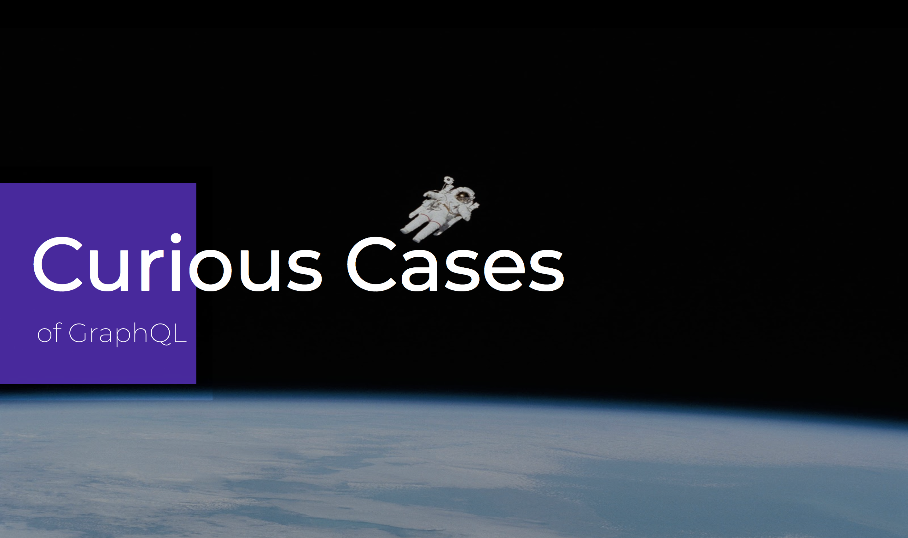

# Curious Cases of GraphQL



## Case 1: Real-time collaborative drawing canvas with GraphQL & AWS AppSync

[GitHub repo](https://github.com/dabit3/appsync-graphql-real-time-canvas)

Base schema:

```graphql
type Canvas @model {
  id: ID!
  clientId: String!
  data: String!
}
```

## Case 2: GraphQL Image Rekognition

[GitHub repo](https://github.com/dabit3/appsync-image-rekognition)

Base schema

```graphql
type ImageData {
  data: String!
}

type Query {
  fetchImage(imageInfo: String!): ImageData
}
```

## Case 3: SpeakerChat - Real-time event comment platform with markdown support

[GitHub repo](https://github.com/dabit3/speakerchat)

Base schema:

```graphql
type Talk @model {
  id: ID!
  title: String!
  speakerName: String!
  clientId: ID
  speakerImage: String
  comments: [Comment] @connection(name: "TalkComments")
}

type Comment @model {
  id: ID!
  talkId: ID!
  clientId: ID
  talk: Talk @connection(sortField: "createdAt", name: "TalkComments", keyField: "talkId")
  text: String
  createdAt: String
  createdBy: String
}

type ModelCommentConnection {
	items: [Comment]
	nextToken: String
}

type Subscription {
	onCreateCommentWithId(talkId: ID!): Comment
		@aws_subscribe(mutations: ["createComment"])
}

type Query {
  listCommentsForTalk(talkId: ID!): ModelCommentConnection
}
```

## Case 4: Hype Beats

[GitHub repo](https://github.com/dabit3/hype-beats)

Base schema:

```graphql
type DrumMachine @model {
  id: ID!
  clientId: ID!
  beats: String!
  name: String!
}
```

## Case 5: GraphQL text to audio translation

[GitHub repo](https://github.com/dabit3/appsync-web-translator)

Base schema:

```graphql
type Query {
  getTranslatedSentence(sentence: String!, code: String!): TranslatedSentence
}

type TranslatedSentence {
  sentence: String!
}
```
